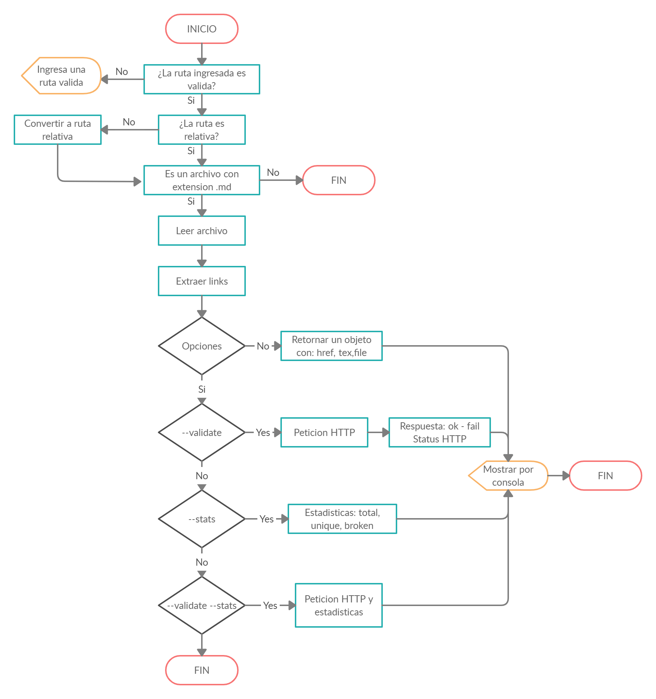

# Markdown Links

## 1. Preámbulo

[Markdown](https://es.wikipedia.org/wiki/Markdown) es un lenguaje de marcado
ligero muy popular entre developers. Es usado en muchísimas plataformas que
manejan texto plano (GitHub, foros, blogs, ...), y es muy común
encontrar varios archivos en ese formato en cualquier tipo de repositorio
(empezando por el tradicional `README.md`).

Estos archivos `Markdown` normalmente contienen _links_ (vínculos/ligas) que
muchas veces están rotos o ya no son válidos y eso perjudica mucho el valor de
la información que se quiere compartir.

## 2. Diagrama de flujo



## 3. Instalación por la interfaz de lina de comando (CLI)

``` js
$ npm install -g Sthephany04/md-links
```

### 3.1 Ejecutando comandos 

- **Obtener links e información:** puedes utilizar la ruta de un archivo con extension markdown o un directorio

```js
$ md-links README.md
```
```sh
/mnt/c/Users/Laboratoria2/BOG001-data-lovers/README.md https://www.figma.com/file/hY1jmIMkONC7RzPzyUpz4P/Untitled  Figma

/mnt/c/Users/Laboratoria2/BOG001-data-lovers/README.md https://www.chartjs.org/  Chart.js

```

- **Validar estado de links:** Opcion --validate para obtener el estado de los links (OK - FAIL). 
Si pasamos la opción `--validate`, el módulo debe hacer una petición HTTP para
averiguar si el link funciona o no. Si el link resulta en una redirección a una
URL que responde ok, entonces consideraremos el link como ok.

```js
$ md-links README.md --validate
```

```sh
/mnt/c/Users/Laboratoria2/BOG001-data-lovers/README.md https://www.figma.com/file/hY1jmIMkONC7RzPzyUpz4P/Untitled OK 200 Figma
 /mnt/c/Users/Laboratoria2/BOG001-data-lovers/README.md https://www.chartjs.org/ OK 200 Chart.js
```

- **Obtener el total de links y los links unicos:** Opcion --stats. el output (salida) será un texto con estadísticas
básicas sobre los links. 

```js
$ md-links README.md --stats
```

```sh
Archivo: /mnt/c/Users/Laboratoria2/BOG001-data-lovers/README.md Links Unicos: 8 Links Totales: 8
```

- **Obtener total de links, unicos y rotos:** Opcion --validate --stats

```js
$ md-links README.md --validate --stats
```

```sh
Archivo: /mnt/c/Users/Laboratoria2/BOG001-data-lovers/README.md Links Unicos: 8 Links Totales: 8 Links rotos: 0
```

## 4. Instalar y utilizar como modulo

Instalar como dependencia

```js 
$ npm install Sthephany04/md-links
```


```js
const mdLinks = require("@sthephany04/md-links");

//obtener datos de un archivo markdown [{ href, text, file }]
mdLinks("some/example.md", { validate: false, stats: false})
  .then(links => {
    console.log(links)
  })
  .catch(console.error);

//Obtener datos [{ href, text, file, status, ok }]
mdLinks("./some/example.md", { validate: true, stats: false })
  .then(links => {
    console.log(links)
  })
  .catch(console.error);

//Obtener estadisticas [{ total, unicos }]
mdLinks("./some/example.md", { validate: false, stats: true })
  .then(links => {
    console.log(links)
  })
  .catch(console.error);

//Obtener estadisticas y validacion de links [{ total, unique, broken }]
mdLinks("./some/example.md", { validate: true, stats: true })
  .then(links => {
    console.log(links)
  })
  .catch(console.error);

//obtener datos de un directorio [{ href, text, file }]
mdLinks("some/dir")
  .then(links => {
    console.log(links)
  })
  .catch(console.error);
```

### Argumentos

* `path`: Ruta absoluta o relativa al archivo o directorio. Si la ruta pasada es
  relativa, debe resolverse como relativa al directorio desde donde se invoca
  node - _current working directory_).
* `options`: Un objeto con las siguientes propiedades:
  - `validate`: Booleano que determina si se desea validar los links
    encontrados.

El comportamiento por defecto no debe validar si las URLs responden ok o no,
solo debe identificar el archivo markdown (a partir de la ruta que recibe como
argumento), analizar el archivo Markdown e imprimir los links que vaya
encontrando, junto con la ruta del archivo donde aparece y el texto
que hay dentro del link

#### Valor de retorno

La función debe retornar una promesa (`Promise`) que resuelva a un arreglo
(`Array`) de objetos (`Object`), donde cada objeto representa un link y contiene
las siguientes propiedades:

* `href`: URL encontrada.
* `text`: Texto que aparecía dentro del link (`<a>`).
* `file`: Ruta del archivo donde se encontró el link.

## 5. Objetivos de aprendizaje

### JavaScript

* [x] Uso de condicionales (if-else | switch | operador ternario)
* [x] Uso de funciones (parámetros | argumentos | valor de retorno)
* [x] Manipular arrays (filter | map | sort | reduce)
* [x] Manipular objects (key | value)
* [x] Uso ES modules ([`import`](https://developer.mozilla.org/en-US/docs/Web/JavaScript/Reference/Statements/import)
| [`export`](https://developer.mozilla.org/en-US/docs/Web/JavaScript/Reference/Statements/export))
* [x] Diferenciar entre expression y statements.
* [x] Diferenciar entre tipos de datos atómicos y estructurados.
* [ ] [Uso de callbacks.](https://developer.mozilla.org/es/docs/Glossary/Callback_function)
* [x] [Consumo de Promesas.](https://scotch.io/tutorials/javascript-promises-for-dummies#toc-consuming-promises)
* [x] [Creación de Promesas.](https://www.freecodecamp.org/news/how-to-write-a-javascript-promise-4ed8d44292b8/)

### Node

* [x] Uso de sistema de archivos. ([fs](https://nodejs.org/api/fs.html), [path](https://nodejs.org/api/path.html))
* [x] Instalar y usar módulos. ([npm](https://www.npmjs.com/))
* [ ] Creación de modules. [(CommonJS)](https://nodejs.org/docs/latest-v0.10.x/api/modules.html)
* [x] [Configuración de package.json.](https://docs.npmjs.com/files/package.json)
* [x] [Configuración de npm-scripts](https://docs.npmjs.com/misc/scripts)
* [x] Uso de CLI (Command Line Interface - Interfaz de Línea de Comando)

### Testing

* [x] [Testeo unitario.](https://jestjs.io/docs/es-ES/getting-started)
* [x] [Testeo asíncrono.](https://jestjs.io/docs/es-ES/asynchronous)
* [ ] [Uso de librerias de Mock.](https://jestjs.io/docs/es-ES/manual-mocks)
* [x] Uso de Mocks manuales.
* [ ] Testeo para múltiples Sistemas Operativos.

### Estructura del código y guía de estilo

* [x] Organizar y dividir el código en módulos (Modularización)
* [x] Uso de identificadores descriptivos (Nomenclatura | Semántica)
* [x] Uso de linter (ESLINT)

### Git y GitHub

* [x] Uso de comandos de git (add | commit | pull | status | push)
* [x] Manejo de repositorios de GitHub (clone | fork | gh-pages)
* [ ] Colaboración en Github (branches | pull requests | |tags)
* [x] Organización en Github (projects | issues | labels | milestones)
* Probar issues y pull request

### HTTP

* [x] Verbos HTTP ([http.get](https://nodejs.org/api/http.html#http_http_get_options_callback))

### Fundamentos de programación

* [ ] [Recursión.](https://www.youtube.com/watch?v=lPPgY3HLlhQ)

## 6. Checklist

### General

* [x] Puede instalarse via `npm install --global <github-user>/md-links`

### `README.md`

* [x] Un board con el backlog para la implementación de la librería.
* [x] Documentación técnica de la librería.
* [x] Guía de uso e instalación de la librería

### API `mdLinks(path, opts)`

* [x] El módulo exporta una función con la interfaz (API) esperada.
* [x] Implementa soporte para archivo individual
* [x] Implementa soporte para directorios
* [x] Implementa `options.validate`

### CLI

* [x] Expone ejecutable `md-links` en el path (configurado en `package.json`)
* [x] Se ejecuta sin errores / output esperado
* [x] Implementa `--validate`
* [x] Implementa `--stats`

### Pruebas / tests

* [x] Pruebas unitarias cubren un mínimo del 70% de statements, functions,
  lines, y branches.
* [x] Pasa tests (y linters) (`npm test`).
